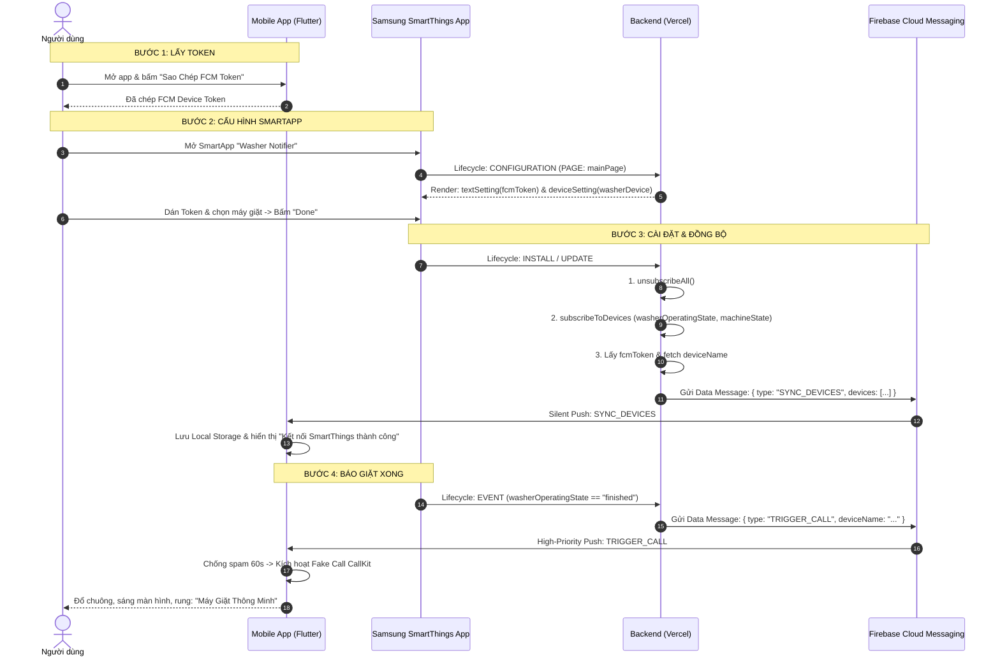

# 🧠 TÀI LIỆU ĐẶC TẢ BUSINESS LOGIC (LOGIC NGHIỆP VỤ)
## Dự án: SmartThings Washer Notifier

> **Tài liệu này tổng hợp toàn bộ các quy tắc nghiệp vụ, luồng xử lý dữ liệu, vòng đời sự kiện, cơ chế chống spam và kiến trúc chịu lỗi của hệ thống SmartThings Washer Notifier.**

---

## 📌 MỤC LỤC
1. [Triết lý Thiết kế & Nguyên tắc Nghiệp vụ](#1-triết-lý-thiết-kế--nguyên-tắc-nghiệp-vụ)
2. [Cấu trúc Dữ liệu & Đặc tả Payload](#2-cấu-trúc-dữ-liệu--đặc-tả-payload)
3. [Nghiệp vụ Vòng đời Backend (SmartApp Lifecycle)](#3-nghiệp-vụ-vòng-đời-backend-smartapp-lifecycle)
   - 3.1. Cấu hình SmartApp (`CONFIGURATION`)
   - 3.2. Cài đặt & Cập nhật (`INSTALL` & `UPDATE`)
   - 3.3. Xử lý Sự kiện máy giặt (`EVENT`)
4. [Nghiệp vụ Xử lý Client (Mobile App Logic)](#4-nghiệp-vụ-xử-lý-client-mobile-app-logic)
   - 4.1. Cơ chế Passive Listener
   - 4.2. Quản lý Local Storage (`SYNC_DEVICES`)
   - 4.3. Kích hoạt Cuộc gọi Giả lập (`TRIGGER_CALL`)
   - 4.4. Cơ chế Chống Spam & Trùng lặp Sự kiện (Anti-Spam Engine)
5. [Quy tắc Xử lý Ngoại lệ & Chịu lỗi (Fault Tolerance)](#5-quy-tắc-xử-lý-ngoại-lệ--chịu-lỗi-fault-tolerance)
6. [Bảng Ma trận Trạng thái & Hành vi Hệ thống](#6-bảng-ma-trận-trạng-thái--hành-vi-hệ-thống)

---

## 1. Triết lý Thiết kế & Nguyên tắc Nghiệp vụ

Hệ thống được xây dựng dựa trên 4 nguyên tắc cốt lõi:

| Nguyên tắc | Mô tả chi tiết | Lợi ích đạt được |
| :--- | :--- | :--- |
| **Zero Database Backend** | Backend hoàn toàn **không lưu trữ cơ sở dữ liệu** (Không MongoDB, PostgreSQL, Redis...). Mọi thông tin người dùng (`fcmToken`) và thiết bị (`washerDevice`) được lưu trữ an toàn trong Context Configuration của chính Samsung SmartThings Cloud. | Không tốn chi phí duy trì database, không rủi ro rò rỉ dữ liệu cá nhân, triển khai serverless 0đ trên Vercel. |
| **Passive Listener Client** | Mobile App đóng vai trò là "Người lắng nghe thụ động". App không gọi API SmartThings, không cần xác thực OAuth2, không cần Personal Access Token (PAT). | App siêu nhẹ, không phụ thuộc token hết hạn của Samsung, không yêu cầu người dùng đăng nhập tài khoản. |
| **Silent Push Driven** | 100% tin nhắn gửi từ Backend qua FCM là **Data-Only Message** (không chứa trường `notification`). | Giúp Mobile App toàn quyền kiểm soát việc đánh thức máy và hiển thị Full-Screen CallKit thay vì bị hệ điều hành hiển thị notification banner nhàm chán. |
| **Full-Screen Fake Call** | Cảnh báo giặt xong được thể hiện dưới dạng **cuộc gọi đến toàn màn hình** (âm thanh chuông, rung, sáng màn hình) thay vì thông báo đẩy thông thường. | Không bị người dùng bỏ lỡ khi đang để máy trong túi hoặc khi máy đang tắt màn hình. |

---

## 2. Cấu trúc Dữ liệu & Đặc tả Payload

### 2.1. Thực thể Dữ liệu (Entities)
1. **`fcmToken` (String):** Mã định danh thiết bị di động do Firebase cấp (`FirebaseMessaging.instance.getToken()`).
2. **`washerDevice` (Array):** Danh sách các thiết bị máy giặt do người dùng chọn trong SmartApp:
   ```json
   [
     {
       "valueType": "DEVICE",
       "deviceConfig": {
         "deviceId": "d5281b1f-97f9-c9f1-23ae-f8d77d8b24d1",
         "componentId": "main"
       }
     }
   ]
   ```
3. **`SyncedDevice` (Object):** Cấu trúc máy giặt được chuẩn hóa để lưu tại Client:
   ```json
   {
     "id": "d5281b1f-97f9-c9f1-23ae-f8d77d8b24d1",
     "name": "Máy giặt Cửa trước Samsung"
   }
   ```

---

### 2.2. Payload FCM Data Message

#### A. Đồng bộ danh sách thiết bị (`SYNC_DEVICES`)
- **Mục đích:** Báo cho Mobile App biết SmartThings đã kết nối thành công và gửi danh sách các máy giặt đang được giám sát.
- **Thời điểm bắn:** Ngay khi người dùng nhấn **Hoàn tất (Done)** lúc Cài đặt hoặc Cập nhật SmartApp.
- **Cấu trúc:**
  ```json
  {
    "data": {
      "type": "SYNC_DEVICES",
      "devices": "[{\"id\":\"d5281b1f-97f9-...\",\"name\":\"Máy giặt Samsung AI\"}]",
      "timestamp": "2026-10-01T06:40:00.000Z"
    },
    "android": { "priority": "high" },
    "apns": { "headers": { "apns-push-type": "background" } }
  }
  ```

#### B. Kích hoạt cuộc gọi giả lập (`TRIGGER_CALL`)
- **Mục đích:** Kích hoạt giao diện cuộc gọi đến toàn màn hình khi quần áo đã giặt xong.
- **Thời điểm bắn:** Khi máy giặt chuyển trạng thái sang `finished` hoặc `stop`.
- **Cấu trúc:**
  ```json
  {
    "data": {
      "type": "TRIGGER_CALL",
      "deviceId": "d5281b1f-97f9-c9f1-23ae-f8d77d8b24d1",
      "deviceName": "Máy giặt Samsung AI",
      "eventId": "event-uuid-1775199600000",
      "title": "Máy giặt",
      "body": "Quần áo trong Máy giặt Samsung AI đã giặt xong!",
      "timestamp": "2026-10-01T06:45:00.000Z"
    },
    "android": { "priority": "high" },
    "apns": { "headers": { "apns-priority": "5", "apns-push-type": "background" } }
  }
  ```

---

## 3. Nghiệp vụ Vòng đời Backend (SmartApp Lifecycle)

Toàn bộ logic Backend được hiện thực trong file [webhook.js](file:///workspace/smart-things/webapp/api/webhook.js) sử dụng `@smartthings/smartapp`:



### 3.1. Cấu hình SmartApp (`CONFIGURATION`)
- **Tên trang:** `Washer Notifier` (`mainPage`).
- **Section nhãn:** `Lựa chọn`.
- **Cấu hình ô Token (`fcmToken`):**
  - Dùng native `textSetting('fcmToken')`.
  - Nhãn hiển thị: `"Lấy mã từ Ứng dụng Washer Notifier"`.
  - Bắt buộc nhập (`required: true`).
- **Cấu hình ô Thiết bị (`washerDevice`):**
  - Dùng `deviceSetting('washerDevice')`.
  - Nhãn hiển thị: `"Danh sách máy giặt"`.
  - Capability: **Chỉ duy nhất 1 capability** là `['washerOperatingState']`.
    > *Lý do kỹ thuật:* Việc truyền nhiều capabilities (ví dụ `['washerOperatingState', 'machineState']`) sẽ kích hoạt logic toán tử `AND` trong SmartThings API, dẫn đến việc danh sách máy giặt bị lọc sạch (trống rỗng) hoặc crash ứng dụng.
  - Quyền truy cập: `'r'` (chỉ đọc).
  - Cho phép chọn nhiều thiết bị: `multiple(true)`.

---

### 3.2. Cài đặt & Cập nhật (`INSTALL` & `UPDATE`)
Mỗi khi người dùng bấm Lưu hoặc Cập nhật cài đặt SmartApp:
1. **Xóa Subscriptions cũ:** Gọi `context.api.subscriptions.unsubscribeAll()` để tránh rò rỉ bộ lắng nghe sự kiện khi người dùng thay đổi máy giặt hoặc dán token mới.
2. **Đăng ký Subscriptions mới:** Lắng nghe 2 thuộc tính trọng yếu của máy giặt:
   - `washerOperatingState` (giá trị: `washing`, `rinsing`, `spinning`, `finished`...).
   - `machineState` (giá trị: `run`, `stop`, `pause`...).
3. **Đọc Cấu hình:**
   - Trích xuất `fcmToken` bằng hàm `context.configStringValue('fcmToken')`.
   - Duyệt mảng `washerDevice`, lấy `deviceId`.
   - Với mỗi thiết bị, gọi `context.api.devices.get(deviceId)` để lấy tên người dùng đặt (`label`) hoặc tên mặc định (`name`).
4. **Bắn thông báo đồng bộ:**
   - Tạo mảng `devicesList = [{ id: deviceId, name: deviceName }]`.
   - Gọi `sendSyncDevicesAlert({ fcmToken, devices: devicesList })`.

---

### 3.3. Xử lý Sự kiện máy giặt (`EVENT`)
Khi máy giặt hoàn thành chu trình:
1. SmartThings Cloud đẩy POST request chứa `eventData`.
2. Hệ thống kiểm tra giá trị của thuộc tính (`value.toLowerCase()`):
   - **Điều kiện kích hoạt:** Giá trị bằng `'finished'` hoặc `'stop'`.
   - **Các giá trị bỏ qua:** `'washing'`, `'rinsing'`, `'spinning'`, `'run'`, `'pause'`...
3. Khi thỏa mãn điều kiện:
   - Trích xuất `fcmToken` của phiên bản app hiện tại (`context.configStringValue('fcmToken')`).
   - Lấy tên máy giặt (`deviceName`) từ `context.api.devices.get()` (nếu không có sẽ mặc định là `"Máy giặt Samsung"`).
   - Bắn Data Message `TRIGGER_CALL` kèm `eventId` độc nhất từ sự kiện.

---

## 4. Nghiệp vụ Xử lý Client (Mobile App Logic)

Toàn bộ logic Client được tổ chức theo kiến trúc sau:
- [main.dart](file:///workspace/smart-things/android_app/lib/main.dart): Bộ định tuyến tin nhắn FCM (Background & Foreground).
- [call_manager.dart](file:///workspace/smart-things/android_app/lib/services/call_manager.dart): Động cơ điều khiển cuộc gọi CallKit & lọc spam.
- [device_storage.dart](file:///workspace/smart-things/android_app/lib/services/device_storage.dart): Quản lý Local Storage.
- [home_screen.dart](file:///workspace/smart-things/android_app/lib/screens/home_screen.dart): Giao diện người dùng tương tác.

### 4.1. Cơ chế Passive Listener
- Khi khởi động, app gọi `FirebaseMessaging.instance.getToken()` lấy chuỗi FCM Device Token và đưa lên màn hình.
- Người dùng chỉ cần 1 thao tác duy nhất: **Bấm "Sao Chép FCM Token"**.
- App không yêu cầu đăng nhập, không lưu token OAuth hay PAT của SmartThings.

---

### 4.2. Quản lý Local Storage (`SYNC_DEVICES`)
Khi Data Message `type: "SYNC_DEVICES"` đến:
1. **Phân giải dữ liệu:**
   - Trường `devices` trong payload là một chuỗi JSON (ví dụ: `'[{"id":"...","name":"..."}]'`).
   - `DeviceStorage.parseDevices()` giải mã chuỗi này thành danh sách `List<SyncedDevice>`.
2. **Lưu trữ vào SharedPreferences:**
   - Key `synced_devices`: Lưu chuỗi JSON của danh sách thiết bị.
   - Key `last_sync_timestamp`: Lưu thời điểm đồng bộ gần nhất (Epoch ms).
3. **Phát sự kiện cập nhật UI:**
   - Đẩy danh sách thiết bị vào Stream `DeviceStorage.onDevicesSynced`.
   - Nếu người dùng đang mở app (`HomeScreen`):
     - State `_syncedDevices` cập nhật tức thì, hiển thị khối **"Máy Giặt Đang Được Giám Sát"**.
     - Bật thanh thông báo SnackBar màu xanh: **"Kết nối SmartThings thành công!"**.
   - Nếu app đang tắt: Dữ liệu đã nằm sẵn trong Local Storage, khi người dùng mở lại app, hàm `_loadSavedDevices()` sẽ tự động đọc ra và hiển thị.

---

### 4.3. Kích hoạt Cuộc gọi Giả lập (`TRIGGER_CALL`)
Khi Data Message `type: "TRIGGER_CALL"` đến:
1. `CallManager.handleFCMMessage` tiếp nhận payload.
2. Kiểm tra bộ lọc chống spam (xem mục 4.4).
3. Thiết lập thông số CallKit (`CallKitParams`):
   - `id`: Tạo UUID ngẫu nhiên bằng `Uuid().v4()`.
   - `nameCaller`: Lấy từ `data['deviceName']`. Nếu rỗng, fallback về `"Máy Giặt Thông Minh"`.
   - `handle`: Nội dung thông điệp (mặc định: `"Quần áo trong máy giặt đã giặt xong!"`).
   - `appName`: `"Washer Notifier"`.
   - `duration`: `45000` (45 giây tự động ngắt nếu không có người nghe).
   - `android`:
     - `isCustomNotification`: `true`.
     - `ringtonePath`: `'system_ringtone_default'`.
     - `backgroundColor`: `'#1565C0'`.
     - `actionColor`: `'#4CAF50'`.
4. Gọi `FlutterCallkitIncoming.showCallkitIncoming(params)`.
5. Hệ điều hành kích hoạt màn hình cuộc gọi toàn màn hình, bật sáng màn hình và rung chuông liên tục.
6. **Xử lý nút bấm trên cuộc gọi:**
   - Nhấn **"Xem ngay" (Accept):** Gọi `AudioService.playWasherDoneSound()` phát giai điệu hoàn tất vui tươi.
   - Nhấn **"Bỏ qua" (Decline):** Đóng giao diện cuộc gọi, dừng rung.

---

### 4.4. Cơ chế Chống Spam & Trùng lặp Sự kiện (Anti-Spam Engine)

Để tránh hiện tượng máy giặt gửi nhiều sự kiện liên tiếp làm điện thoại đổ chuông dồn dập, `CallManager` áp dụng **2 tầng bảo vệ**:

```text
Incoming FCM Message
        │
        ▼
[TẦNG 1: LỌC TRÙNG EVENT ID]
Đã xử lý eventId này chưa? ─── Có ───► [BỎ QUA (DROP)]
        │ Không
        ▼
[TẦNG 2: CỬA SỔ THỜI GIAN 60S]
Thời gian từ lần gọi trước < 60s? ─── Có ───► [BỎ QUA (DROP)]
        │ Không
        ▼
Lưu eventId & Ghi nhận timestamp hiện tại
        │
        ▼
[KÍCH HOẠT FAKE CALL]
```

1. **Tầng 1 - Deduplication theo `eventId`:**
   - Duy trì tập hợp `Set<String> _processedEventIds`.
   - Nếu `eventId` gửi kèm đã có trong tập hợp ➜ Lập tức bỏ qua.
2. **Tầng 2 - Cửa sổ chống spam 60 giây (`antiSpamWindowMs = 60000`):**
   - Biến `_lastCallTimestamp` lưu thời điểm kích hoạt cuộc gọi trước đó.
   - Nếu `currentTime - _lastCallTimestamp < 60,000 ms` ➜ Bỏ qua với thông báo:
     `"Vừa gọi cách đây Xs (chặn lặp 60s)"`.

---

## 5. Quy tắc Xử lý Ngoại lệ & Chịu lỗi (Fault Tolerance)

| Tình huống sự cố | Giải pháp xử lý kỹ thuật |
| :--- | :--- |
| **Vercel Serverless Cold Start** | Thư viện `firebase-admin` được bọc trong hàm Singleton `getFirebaseAdmin()`. Nếu app đã khởi tạo thì tái sử dụng instance, tránh lỗi `[DEFAULT] Firebase App already exists`. |
| **App Android bị Kill hoàn toàn (Killed State)** | Hàm `firebaseMessagingBackgroundHandler` được đánh dấu bằng `@pragma('vm:entry-point')`. Dart VM sẽ khởi chạy một isolate riêng để hứng Data Message ngay cả khi ứng dụng không có Activity nào hoạt động. |
| **SmartThings API 401 khi lấy tên máy giặt** | Khối gọi `context.api.devices.get()` được bọc trong `try...catch`. Nếu không lấy được tên máy, hệ thống tự động fallback về tên an toàn: `"Máy giặt Samsung"`. |
| **Lỗi định dạng Private Key Firebase trong `.env`** | `fcmService.js` tự động phát hiện và thay thế chuỗi escape `\\n` thành ký tự xuống dòng chuẩn `\n` trước khi nạp vào chứng chỉ Firebase. |
| **Người dùng dán chuỗi Token có khoảng trắng thừa** | `home_screen.dart` sử dụng `Clipboard.setData()` trực tiếp từ chuỗi token chuẩn không qua gõ phím. `DeviceStorage.parseDevices()` tự động `trim()` chuỗi JSON trước khi parse. |
| **Màn hình điện thoại đang khóa (Keyguard)** | Thẻ `<activity>` trong `AndroidManifest.xml` được cấu hình `android:showOnLockScreen="true"` và `android:turnScreenOn="true"` kết hợp quyền `USE_FULL_SCREEN_INTENT` để đánh thức màn hình ngay tức khắc. |

---

## 6. Bảng Ma trận Trạng thái & Hành vi Hệ thống

| Sự kiện đầu vào | Thành phần tiếp nhận | Hành vi nghiệp vụ được thực hiện | Trạng thái hiển thị Client |
| :--- | :--- | :--- | :--- |
| Mở Mobile App lần đầu | Mobile App | Gọi `getToken()`, đọc `SharedPreferences` | Hiển thị FCM Token + trạng thái "Người Lắng Nghe Thụ Động" |
| Lưu SmartApp trên SmartThings | Backend Webhook | Unsubscribe cũ, tạo subscribe mới, gửi `SYNC_DEVICES` | SnackBar: *"Kết nối SmartThings thành công!"* + Card hiển thị tên máy |
| Máy giặt đang giặt (`washing`) | Backend Webhook | Bỏ qua sự kiện | Không có thông báo (im lặng) |
| Máy giặt đang vắt (`spinning`) | Backend Webhook | Bỏ qua sự kiện | Không có thông báo (im lặng) |
| Máy giặt báo xong (`finished`) | Backend Webhook | Gửi FCM `TRIGGER_CALL` ưu tiên cao | Đổ chuông toàn màn hình CallKit ("Máy Giặt Thông Minh") |
| Máy giặt lặp lại sự kiện trong 30s | Mobile App | Bộ lọc Anti-Spam 60s phát hiện | Bỏ qua (không rung chuông thêm lần nữa) |
| Người dùng bấm "Xem ngay" | Mobile App | Gọi `AudioService.playWasherDoneSound()` | Phát âm thanh nhạc chuông báo hoàn tất |
| Người dùng bấm "Bỏ qua" | Mobile App | Đóng CallKit | Màn hình cuộc gọi biến mất, không phát nhạc |
| Mở lại App sau vài ngày | Mobile App | `_loadSavedDevices()` đọc từ Local Storage | Danh sách máy giặt vẫn hiển thị đầy đủ không bị mất |

---

*Tài liệu được cập nhật lần cuối: 2026-10-01*
