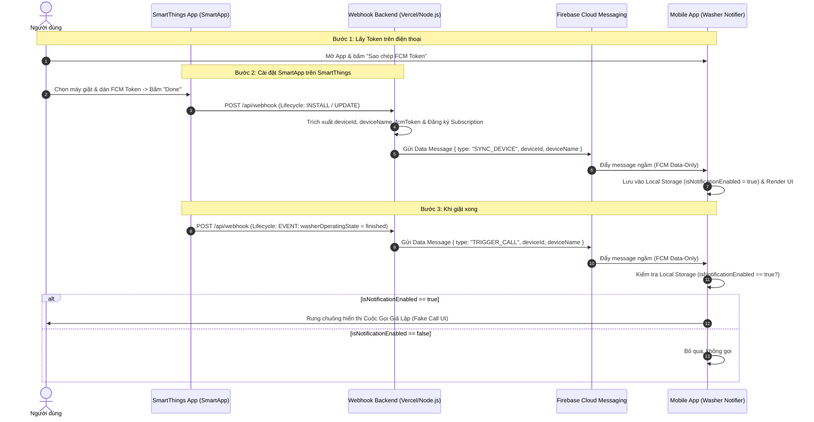

# Kế Hoạch Triển Khai: Kiến Trúc SmartApp Webhook & FCM Tự Động Đồng Bộ (SYNC_DEVICE & TRIGGER_CALL)

> **For agentic workers:** REQUIRED SUB-SKILL: Use superpowers:executing-plans to implement this plan task-by-task. Steps use checkbox (`- [ ]`) syntax for tracking.

**Goal:** Thay thế hoàn toàn luồng OAuth2 phức tạp bằng kiến trúc SmartThings SmartApp Webhook trực tiếp: tự động đồng bộ thiết bị qua FCM Data Message (`SYNC_DEVICE`) khi người dùng cài đặt/cập nhật SmartApp, và tự động kích hoạt cuộc gọi giả lập (`TRIGGER_CALL`) khi máy giặt hoàn thành chu trình giặt (kèm điều kiện kiểm tra bật/tắt trong Local Storage).

**Architecture:** 
1. **Backend (Node.js/Vercel):** Khi SmartThings gửi `INSTALL`/`UPDATE`, backend trích xuất `fcmToken`, `deviceId`, `deviceName` từ cấu hình người dùng, lập tức gửi FCM Data Message `{ type: "SYNC_DEVICE" }` về điện thoại. Khi SmartThings gửi `EVENT` (`finished`), backend gửi FCM Data Message `{ type: "TRIGGER_CALL" }` về `fcmToken`.
2. **Mobile App (Flutter):** Lắng nghe FCM background & foreground handler. Nếu nhận `SYNC_DEVICE`, tự động lưu/cập nhật thiết bị vào Local Storage (mặc định `isNotificationEnabled = true`). Nếu nhận `TRIGGER_CALL`, kiểm tra trong Local Storage: CHỈ hiển thị Fake Call UI nếu `isNotificationEnabled === true`. UI hiển thị danh sách thiết bị có Switch/Toggle bật/tắt và thẻ sao chép FCM Token.

**Tech Stack:** Node.js (Express / Vercel Serverless), Firebase Admin SDK (FCM Data Messages), Flutter 3.x, `firebase_messaging`, `flutter_callkit_incoming`, `shared_preferences`.

---

## User Review Required

> [!IMPORTANT]
> **Loại bỏ phụ thuộc vào Samsung OAuth2 Redirect Flow:** Với kiến trúc mới này, bạn không cần phải đăng nhập Samsung trên web di động và không cần cấu hình Redirect URI phức tạp nữa. Thay vào đó:
> 1. Trên điện thoại: App sẽ hiển thị sẵn **FCM Device Token** kèm nút **"Sao chép Token"**.
> 2. Trong SmartThings app: Bạn mở SmartApp, dán FCM Token và chọn máy giặt.
> 3. Backend sẽ tự động bắn `SYNC_DEVICE` để điện thoại của bạn xuất hiện ngay chiếc máy giặt đó, kèm công tắc Bật/Tắt!

---

## Proposed Changes



---

### Component 1: Backend Webhook & FCM Service (Node.js)

#### [MODIFY] `webapp/lib/fcmService.js`
- Bổ sung hàm chuyên biệt `sendSyncDeviceAlert({ fcmToken, deviceId, deviceName })`:
  - Gửi Data-only message với `type: "SYNC_DEVICE"`.
  - Chứa `deviceId`, `deviceName`, `timestamp`.
  - Không chứa trường `notification` (để tránh push pop-up mặc định của hệ điều hành, đảm bảo app tự xử lý ngầm).
- Bổ sung hàm chuyên biệt `sendTriggerCallAlert({ fcmToken, deviceId, deviceName, eventId })`:
  - Gửi Data-only message với `type: "TRIGGER_CALL"`.
  - Chứa `deviceId`, `deviceName`, `eventId`, `timestamp`.
  - Đặt độ ưu tiên `priority: 'high'` (Android) và `content-available: 1` (iOS) để đánh thức điện thoại ngay lập tức khi màn hình tắt.

#### [MODIFY] `webapp/api/webhook.js`
- **Xử lý `CONFIGURATION` Lifecycle:**
  - Định nghĩa form cấu hình SmartApp trong ứng dụng SmartThings:
    - Input text: `fcmToken` (Nhập FCM Token của điện thoại).
    - Input device: `washerDevice` (Chọn máy giặt / sấy, capability: `washerOperatingState`).
- **Xử lý `INSTALL` & `UPDATE` Lifecycle:**
  - Trích xuất `fcmToken` và `deviceId` từ payload cấu hình (`req.body.installData.installedApp.config` hoặc `req.query`).
  - Lấy `deviceName` từ SmartThings API hoặc fallback từ cấu hình.
  - Tự động đăng ký Subscription cho thiết bị với SmartThings.
  - **Lập tức gửi Data Message:** `sendSyncDeviceAlert({ fcmToken, deviceId, deviceName })`.
- **Xử lý `EVENT` Lifecycle:**
  - Trích xuất `deviceId` từ event và `fcmToken`, `deviceName` từ query parameters hoặc stored mapping.
  - Khi `washerOperatingState === 'finished'`:
    - **Lập tức gửi Data Message:** `sendTriggerCallAlert({ fcmToken, deviceId, deviceName, eventId })`.

---

### Component 2: Mobile App Data Storage & FCM Background Handler (Flutter)

#### [MODIFY] `android_app/lib/services/device_storage.dart`
- Thêm phương thức `upsertDevice`:
  ```dart
  static Future<DeviceItem> upsertDevice({
    required String id,
    required String name,
    String? modelCode,
  }) async {
    final list = await getDevices();
    final index = list.indexWhere((d) => d.id == id);
    if (index != -1) {
      // Cập nhật tên nếu có thay đổi, giữ nguyên trạng thái switch người dùng đã chọn
      list[index].name = name;
      if (modelCode != null) list[index].modelCode = modelCode;
      await saveDevices(list);
      return list[index];
    } else {
      // Thiết bị mới: thêm mới và mặc định BẬT nhận cuộc gọi
      final newDev = DeviceItem(
        id: id,
        name: name,
        modelCode: modelCode ?? 'Samsung Smart Washer',
        serialNumber: 'ID-${id.length > 8 ? id.substring(0, 8) : id}',
        isNotificationEnabled: true,
        status: 'Đã đồng bộ tự động',
      );
      list.add(newDev);
      await saveDevices(list);
      return newDev;
    }
  }
  ```
- Thêm phương thức `setNotificationEnabled(String deviceId, bool isEnabled)` để lưu trực tiếp khi người dùng gạt Switch trên UI.
- Thêm `ValueNotifier<int>` để thông báo cho UI reload ngay khi có thiết bị mới từ background FCM mà không cần khởi động lại app.

#### [MODIFY] `android_app/lib/services/call_manager.dart`
- Cập nhật hàm `handleFCMMessage(Map<String, dynamic> data)`:
  ```dart
  static Future<void> handleFCMMessage(Map<String, dynamic> data) async {
    final type = data['type'];
    debugPrint('[CallManager] Nhận FCM message type: $type');

    if (type == 'SYNC_DEVICE') {
      final deviceId = data['deviceId'] ?? data['device_id'];
      final deviceName = data['deviceName'] ?? data['device_name'] ?? 'Máy giặt Samsung';
      if (deviceId != null && deviceId.toString().isNotEmpty) {
        await DeviceStorage.upsertDevice(
          id: deviceId.toString(),
          name: deviceName.toString(),
        );
        debugPrint('[CallManager ✅] Đã tự động đồng bộ thiết bị: $deviceName ($deviceId)');
      }
      return;
    }

    if (type == 'TRIGGER_CALL' || type == 'WASHING_MACHINE_DONE') {
      final deviceId = data['deviceId'] ?? data['device_id'];
      final eventId = data['eventId'] ?? data['event_id'];

      // Kiểm tra trong Local Storage: CHỈ hiển thị Fake Call UI nếu isNotificationEnabled === true
      final authorizedDevice = await validateAndAuthorizeCall(
        deviceId: deviceId,
        eventId: eventId,
      );

      if (authorizedDevice != null) {
        debugPrint('[CallManager 📞] Thiết bị "${authorizedDevice.name}" đang BẬT thông báo -> Kích hoạt cuộc gọi!');
        await triggerIncomingCall(authorizedDevice);
      } else {
        debugPrint('[CallManager 🔕] Bỏ qua cuộc gọi vì thiết bị đang TẮT thông báo hoặc bị chặn chống spam.');
      }
    }
  }
  ```

---

### Component 3: UX/UI Thiết Bị & Quản Lý Công Tắc (Flutter)

#### [MODIFY] `android_app/lib/screens/device_list_screen.dart`
- **Thẻ hiển thị FCM Token:**
  - Lấy FCM Token thực tế của máy qua `FirebaseMessaging.instance.getToken()`.
  - Hiển thị ô token rút gọn kèm nút **"Sao chép FCM Token"** (sao chép vào clipboard và hiện SnackBar thông báo).
  - Hướng dẫn trực quan: *"Dán Token này vào cấu hình SmartApp trên Samsung SmartThings để tự động nhận diện máy giặt."*
- **Danh sách máy giặt & Công tắc Bật/Tắt:**
  - Mỗi thẻ máy giặt hiển thị tên máy, ID, và **Switch (công tắc)** bật/tắt nhận cuộc gọi.
  - Khi người dùng gạt công tắc: gọi `DeviceStorage.setNotificationEnabled` và lưu tức thì.
  - Khi công tắc TẮT: hiển thị màu xám, icon tắt chuông. Khi BẬT: hiển thị màu xanh lá, icon chuông hoạt động.
- **Tự động làm mới UI:**
  - Lắng nghe sự kiện từ `DeviceStorage` để tự động render lại danh sách ngay khi backend bắn `SYNC_DEVICE` tới mà không cần người dùng phải bấm F5 hay kéo reload.

---

## Verification Plan

### Automated Tests
1. **Kiểm tra Backend FCM & Webhook Logic:**
   - Tạo script `webapp/scripts/test-new-flow.js` kiểm thử:
     - Giả lập SmartThings gửi payload `INSTALL` chứa `fcmToken` và `deviceId` -> verify backend gọi `sendSyncDeviceAlert` đúng cấu trúc data payload `{ type: "SYNC_DEVICE", deviceId, deviceName }`.
     - Giả lập SmartThings gửi payload `EVENT` (`finished`) -> verify backend gọi `sendTriggerCallAlert` đúng cấu trúc data payload `{ type: "TRIGGER_CALL", deviceId, deviceName }`.
   - Lệnh: `node webapp/scripts/test-new-flow.js`
2. **Kiểm tra Flutter Source Code:**
   - Lệnh: `flutter analyze` trong thư mục `android_app` -> Đảm bảo `0 issues`.
3. **Kiểm tra biên dịch Release APK:**
   - Lệnh: `flutter build apk --release --split-per-abi --android-skip-build-dependency-validation`
   - Kiểm tra file đầu ra `washer-notifier.apk`.

### Manual Verification
1. Mở App trên điện thoại -> Xem thẻ **FCM Device Token** -> Bấm **Sao chép**.
2. Thử kích hoạt giả lập `SYNC_DEVICE` từ backend -> Kiểm tra xem danh sách thiết bị trên App có tự động thêm máy giặt với công tắc bật/tắt hay không.
3. Thử gạt công tắc sang **TẮT** -> Kích hoạt giả lập `TRIGGER_CALL` -> Kiểm tra App **KHÔNG** rung chuông hay hiện cuộc gọi.
4. Gạt công tắc sang **BẬT** -> Kích hoạt giả lập `TRIGGER_CALL` -> Kiểm tra App **RUNG CHUÔNG VÀ HIỆN CUỘC GỌI** bình thường.
